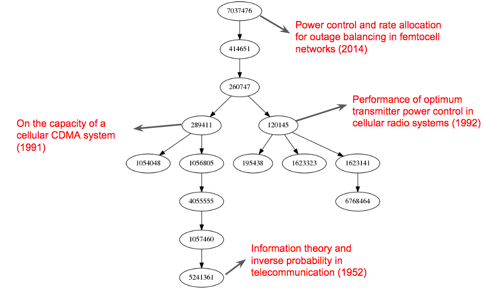
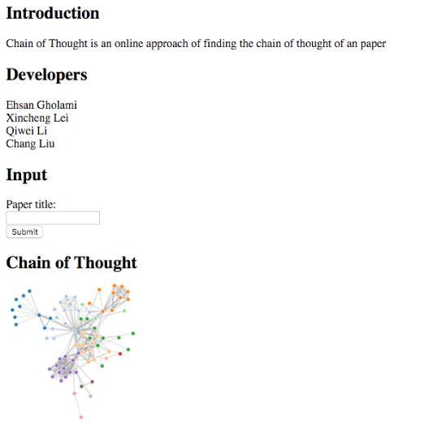

# chain-of-thought
An online system that extracts the evolution of ideas of a IEEE paper.
## Authors
* Ehsan Gholami
* Chang Liu
* Qiwei Li 
* Xincheng Lei

## Motivation
Imagine this. You need to read a newly published physic paper. It is very difficult to understand because new technical terms . You really really want to read some important references of that paper so you can understand the idea from scratch. Don’t you want a tool that can show you the “chain of thought”?

## Example
* First, use many layers of citation and referencec links of a paper from the IEEE database to build a network.
* Then use a scoring appraoch to selection the most important path of the network.

* Finally, build an UI 
