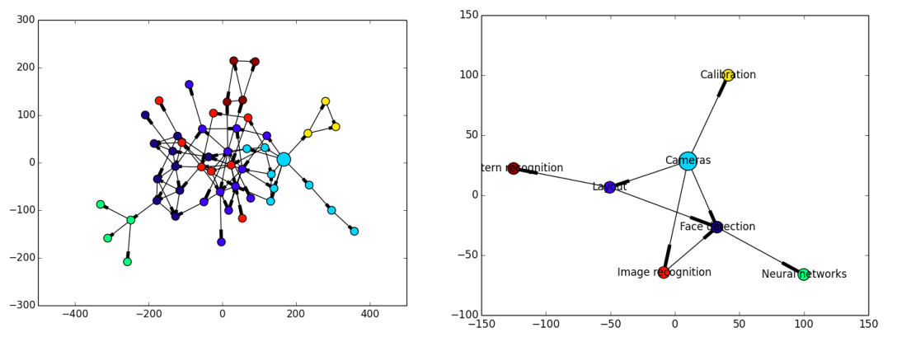

# chain-of-thought
A tool that extracts the evolution of a IEEE paper's ideas using an online approach.
## Authors
* Ehsan Gholami
* Chang Liu
* Qiwei Li 
* Xincheng Lei

## Motivation
Imagine this. You need to read a newly published physic paper. It is very difficult to understand because new technical terms . You really really want to read some important references of that paper so you can understand the idea from scratch. Don’t you want a tool that can show you the “chain of thought”?

## Approach
1. Scrape from IEEE database to build a citation/reference network.
2. Use a scoring system to select the most important sub-network of papers
3. Further divide the network into clusters and find the most significant ideas
4. Build UI (developing)

## Example

